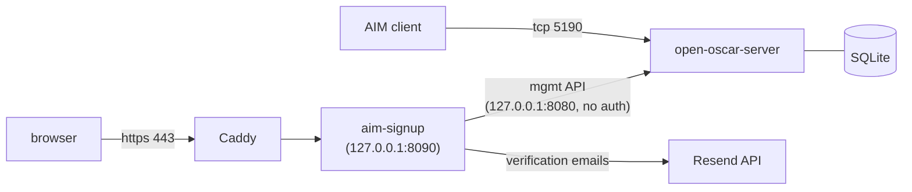

# AIM server on GCP

A self-hosted AIM/ICQ server on a free-tier GCP VM, with **email-verified
signups**. Classic clients (Windows AIM 5.1, Pidgin, whatever your vintage
hardware runs) connect on port 5190. New users get a signup page, prove
they own an email address, and their screen name is created only after they
click the verification link. Running cost is roughly the price of the
external IPv4 address: **~$3/month**.

A live instance runs at [aim.aaddrick.com](https://aim.aaddrick.com) if you
want to try it before deploying your own: sign up there, then point your
client at host `aim.aaddrick.com`, port `5190`.

The direct inspiration is Veronica Explains'
[Forget Discord, I'm switching back to AIM](https://youtu.be/VDQTuJWST4M),
which walks through hosting your own server and makes the case for it:
platforms die, protocols live forever.

The server is [mk6i/open-oscar-server](https://github.com/mk6i/open-oscar-server),
a modern implementation of the OSCAR protocol AOL retired in 2017. What
this repo adds is the deployment (Terraform + a provisioning script) and
the piece the server doesn't have: a signup flow. Out of the box,
open-oscar-server either auto-creates accounts with no password check
(`DISABLE_AUTH=true`) or makes an admin create every account by hand with
`curl`. Neither is something you'd point friends at.

## How it fits together

The server runs with authentication required, so its loopback-only
management API is the only way to create accounts. And `aim-signup`
(a dependency-free Go service) is the only thing that calls it. Signups are
protected by per-IP rate limiting, a honeypot field, and a configurable
daily email cap sized to your [Resend](https://resend.com) plan.

The signup form never asks for a password, so the service never has one to
store. Once the email verifies, the account is created with a generated
password shown exactly once. From there users change it inside the client
(AIM and Pidgin both speak OSCAR's password-change command) or through a
reset link emailed to the address that verified the account.

## Layout

| Path | What |
|---|---|
| `terraform/` | VM, firewall, static IP, Cloud DNS (incl. Resend DKIM/SPF/MX), Secret Manager, backup bucket, uptime alerting |
| `signup/` | The signup/verification service. Stdlib-only Go; `go test ./...` |
| `deploy/` | `setup.sh` provisioner, systemd units, backup script, email-DNS checker |
| [`DEPLOYMENT.md`](DEPLOYMENT.md) | Step-by-step: from empty GCP project to chatting |

## Source material

- 📺 [Forget Discord, I'm switching back to AIM](https://youtu.be/VDQTuJWST4M) —
  Veronica Explains (July 2026). The video that started this.
- 📝 [Hosting your own AIM server with Open OSCAR Server](https://veronicaexplains.net/open-oscar-server/) —
  the companion blog post with the manual setup this repo automates.
- 🧑‍💻 [mk6i/open-oscar-server](https://github.com/mk6i/open-oscar-server) —
  the server itself: AIM 1.x–7.x, ICQ 98x–2003x, TOC, chat rooms, buddy
  icons, file transfer. MIT-licensed Go.
- 📜 [AOL's OSCAR protocol documentation](https://web.archive.org/web/20080308233204/http://dev.aol.com/aim/oscar/) —
  archived from dev.aol.com (2008), for the protocol-curious.

Clients that work: classic Windows AIM (5.1 is the upstream
recommendation and runs under Wine too), Pidgin on modern systems, and
period-correct clients on whatever vintage hardware you've been meaning to
justify.

## A note on security

OSCAR is a 1990s protocol: traffic is plaintext and password handling is
era-authentic. It's part of the charm, but plan around it. Never reuse a
password you care about, and read the security notes in
[DEPLOYMENT.md](DEPLOYMENT.md#security-notes) before inviting the internet.
